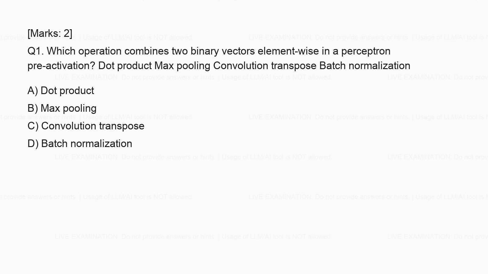

# Quiz LLM Formatting

Teacher-friendly tooling to generate quiz-question images with exam-warning watermarks.

## What This Provides

- Streamlit app for teachers to build one or more quiz questions.
- Each question supports:
  - Question text
  - Optional question image (shown before question text)
  - Option text and/or option images
- Repeated watermark application on:
  - Final rendered question image
  - Any embedded uploaded image used in question/options
- Docker and Docker Compose setup to run on `localhost:12000`.

## Repository Contents

- `app.py`: Streamlit teacher UI.
- `quiz_questions_to_images.py`: CLI generator for URL-based extraction/rendering.
- `requirements_streamlit_app.txt`: Streamlit app dependencies.
- `requirements_quiz_images.txt`: CLI pipeline dependencies.
- `Dockerfile`: Container image for Streamlit app.
- `docker-compose.yml`: Compose service exposing `12000:12000`.
- `sample_question.png`: Example generated output.

## Run With Docker Compose

```bash
cd quiz-llm-formatting
docker compose up
```

Open:

```text
http://localhost:12000
```

Stop:

```bash
docker compose down
```

## Run Locally (Without Docker)

```bash
python3 -m pip install -r requirements_streamlit_app.txt
streamlit run app.py --server.address 0.0.0.0 --server.port 12000
```

## Sample Output



## License

This project is licensed under the MIT License. See `LICENSE`.
